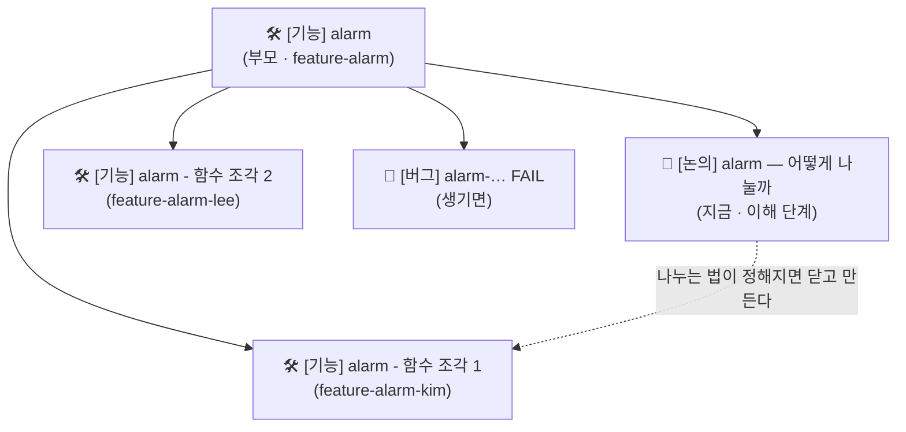

# 📋 ThreeJ 팀 깃 프로젝트 사용법

> 일정 관리와 서로의 진척도 확인은 팀 깃 프로젝트 하나로 합니다.
> 이슈는 저장소의 템플릿 3개 (🛠 기능 구현 · 🐞 버그 · 💬 질문/논의) 로만 만듭니다.
> 커밋 · PR 제목은 **[커밋 컨벤션](./Commit_Convention.md)**, 브랜치는 **[GitHub 전략 문서](./Github_Strategy.md)** 를 보세요.

**목차**
[1. 한눈에 보기](#1-한눈에-보기) ·
[2. 이슈 구조](#2-이슈-구조) ·
[3. 부모 기능 이슈 6개](#3-부모-기능-이슈-6개) ·
[4. 칸 (필드)](#4-칸-필드) ·
[5. 보기 (view)](#5-보기-view) ·
[6. 자동화](#6-자동화) ·
[7. 하루 흐름](#7-하루-흐름) ·
[8. 만드는 순서 (관리자)](#8-만드는-순서-관리자)

---

## 1. 한눈에 보기



| 템플릿 | 라벨 | 프로젝트에서 자리 | 짝이 되는 브랜치 · PR |
|---|---|---|---|
| 🛠 기능 구현 (부모) | `enhancement` | 기능 하나 | `feature-<기능>` · 기능 → dev PR |
| 💬 질문/논의 | `question` | 부모 아래 하위 · 이해 단계 | 없음 (댓글로 정한다) |
| 🛠 기능 구현 (하위) | `enhancement` | 부모 아래 하위 · 함수 조각 | `feature-<기능>-<이름>` · 개인 → 기능 PR |
| 🐞 버그 | `bug` | 그 기능 부모 아래 하위 | 고치는 브랜치 |

- 부모의 **하위 진행률 막대 = 그 기능의 진척도**
- 테스트 27개는 이슈로 따로 만들지 않는다 → 기능 이슈의 「통과시킬 테스트」 칸에 적는다

---

## 2. 이슈 구조

```
#1 [기능] alarm                          ← 부모 · feature-alarm
 ├ #7  [논의] alarm — 어떻게 나눌까        ← 지금 만든다 · 정해지면 닫는다
 ├ #13 [기능] alarm - timer_sleep 재우기   ← 나중에 · feature-alarm-kim
 ├ #14 [기능] alarm - 인터럽트에서 깨우기   ← 나중에 · feature-alarm-lee
 └ #15 [버그] alarm-simultaneous FAIL     ← 생기면
```

1. **지금 (이해 단계)** : 부모 기능 이슈 6개 + 기능마다 💬 논의 이슈 하나
   - 공부한 내용, 나누는 방법 제안을 논의 이슈 **댓글**로 남긴다
2. **나누는 법이 정해지면** : 논의 이슈를 닫고, 정한 대로 🛠 하위 기능 이슈를 만든다
   - 하위 이슈 「작업 브랜치」 칸 = 내 개인 브랜치 (`feature-alarm-kim`)
3. **구현 중 문제가 생기면** : 🐞 버그 이슈를 그 기능 부모 아래 붙인다
4. **기능이 다 되면** : 기능 → dev PR 이 머지되고 부모 이슈를 닫는다

- 하위 이슈 붙이는 법 : 부모 이슈 화면 아래 **Sub-issues → Add sub-issue** (또는 **Create sub-issue**)
- 기능 사이에 걸친 논의 (예 : `struct thread` 필드 이름) 는 부모 없이 둔다 → 「기능」 칸 = `공통`

---

## 3. 부모 기능 이슈 6개

| 부모 | 「기능 이름」 · 기능 브랜치 | 무엇 | 통과시킬 테스트 |
|---|---|---|---|
| `[기능] alarm` | `alarm` · `feature-alarm` | 바쁜 대기 없이 재우고 깨우기 | alarm-single · multiple · simultaneous · zero · negative · priority (6) |
| `[기능] priority` | `priority` · `feature-priority` | ready list 우선순위 순서 · 선점 · `thread_set_priority` | priority-change · preempt · fifo (3) |
| `[기능] sync` | `sync` · `feature-sync` | 세마포어 · condvar 대기열을 우선순위 순으로 | priority-sema · condvar (2) |
| `[기능] donation` | `donation` · `feature-donation` | lock 우선순위 기부 (중첩 · 여러 개) | priority-donate-one · multiple · multiple2 · nest · chain · sema · lower (7) |
| `[기능] fixed-point` | `fixed-point` · `feature-fixed-point` | 17.14 고정소수점 연산 | 없음 (mlfqs 가 쓴다) |
| `[기능] mlfqs` | `mlfqs` · `feature-mlfqs` | nice · recent_cpu · load_avg · 우선순위 다시 계산 | mlfqs-load-1 · load-60 · load-avg · recent-1 · fair-2 · fair-20 · nice-2 · nice-10 · block (9) |

- 순서 (먼저 끝나야 하는 것)
  - `alarm-priority` 는 `priority` 가 있어야 통과한다
  - `sync` · `donation` 은 `priority` 다음
  - `mlfqs` 는 `fixed-point` 다음
- 부모 이슈 「구현할 함수 / 수정할 파일」 칸 : 이해 단계라 모르면 `논의 이슈에서 정함` 으로 두고 나중에 고친다

---

## 4. 칸 (필드)

| 칸 | 종류 | 값 | 누가 채우나 |
|---|---|---|---|
| Status | 단일 선택 | Todo · In Progress · Review · Done | 추가 · 닫힘은 자동, 나머지는 본인 |
| 기능 | 단일 선택 | alarm · priority · sync · donation · fixed-point · mlfqs · 공통 | 이슈 만든 사람 |
| 시작일 | 날짜 | | 담당자 |
| 마감일 | 날짜 | | 담당자 |
| Assignees | 기본 | 팀원 | 담당자 |
| Labels | 기본 | enhancement · bug · question | 템플릿이 자동 |
| Parent issue · Sub-issues progress | 기본 | | GitHub 가 자동 |
| Linked pull requests | 기본 | | PR 의 Development 연결로 자동 |

- Status 뜻

| Status | 뜻 |
|---|---|
| Todo | 만들었고 아직 손 안 댐 |
| In Progress | 브랜치를 땄다 · 공부 중 (논의 이슈) |
| Review | PR 을 열었다 · 리뷰나 머지를 기다린다 |
| Done | 머지됐다 · 정해졌다 (논의 이슈) |

- 「기능」 값은 커밋 괄호 · 브랜치 이름과 **같은 글자** 를 쓴다
  - 예외 : `공통` = 기능 사이에 걸친 일. 커밋에서는 `struct thread` 쪽이면 `(thread)`, 문서 · 설정이면 괄호 없이
- 「단계」 칸은 만들지 않는다 → 종류는 라벨이 이미 나눈다 (`question` = 이해 · `enhancement` = 구현 · `bug`)

---

## 5. 보기 (view)

| 보기 | 모양 | 설정 | 언제 |
|---|---|---|---|
| **오늘** | 보드 | 열 = Status · Slice by = Assignees | 코어타임에 이 화면 하나 |
| **기능별 진척도** | 표 | Group by = 기능 · 칸 = Title · Status · Assignees · Sub-issues progress · Linked pull requests | 하루 끝 · 누가 어디까지 했나 |
| **일정** | 로드맵 | 막대 = 시작일 ~ 마감일 · Group by = 기능 | 계획 · 늦어지는 기능 찾기 |
| **내 일** | 표 | 필터 `assignee:@me -status:Done` | 각자 |

- 한 기능만 보고 싶으면 필터 `parent-issue:picky232/ThreeJ-team-Pintos#번호` (부모 이슈 번호)
- 「기능별 진척도」 에서 부모 줄의 Sub-issues progress 막대가 그 기능의 진척도다

---

## 6. 자동화

프로젝트 오른쪽 위 **⋯ → Workflows** 에서 켠다.

| 워크플로 | 설정 | 하는 일 |
|---|---|---|
| Auto-add to project | 저장소 `ThreeJ-team-Pintos` · 필터 `is:issue` | 새 이슈가 저절로 프로젝트에 들어온다 |
| Item added to project | → Todo | |
| Item closed | → Done | |
| Pull request merged | → Done | |
| **Auto-close issue** | Status 가 Done 이 되면 | **보드에서 카드를 Done 으로 옮기면 이슈가 닫힌다** |

- PR 은 프로젝트에 넣지 않는다 → 이슈의 「Linked pull requests」 칸으로 본다
  - 무료 플랜은 Auto-add 를 하나만 켤 수 있어서 이슈만 넣는다
- 이슈를 닫는 법은 둘 중 아무거나
  - 보드에서 카드를 Done 으로 옮긴다 (Auto-close 가 닫는다)
  - 이슈를 직접 닫는다 (Item closed 가 Done 으로 옮긴다)
- PR 본문의 `Closes #번호` 로는 닫히지 않는다 → 기본 브랜치(`main`)를 향한 PR 에서만 읽힌다 ([커밋 컨벤션 6절](./Commit_Convention.md#6-이슈와-잇는-법))

---

## 7. 하루 흐름

| 언제 | 할 일 |
|---|---|
| 일을 시작할 때 | 내 카드를 **In Progress** 로 옮긴다 · 시작일 · 마감일 채우기 |
| 개인 브랜치를 땄을 때 | 하위 기능 이슈 「작업 브랜치」 칸 확인 |
| PR 을 열 때 | 본문 「관련 이슈」 에 `#번호` · 오른쪽 **Development** 에서 이슈 연결 · 카드를 **Review** 로 |
| PR 이 머지됐을 때 | 카드를 **Done** 으로 → 이슈가 자동으로 닫힌다 |
| 코어타임 | **오늘** 보드를 띄우고 담당자별로 "어제 Done · 오늘 In Progress · Review 기다리는 것" |
| 하루 끝 | **기능별 진척도** 에서 막대 확인 · 마감일 넘긴 카드 이야기 |

- 논의 이슈 (이해 단계)
  - 공부를 시작하면 In Progress
  - 공부한 내용 · 나누는 방법 제안을 댓글로
  - 셋이 합의하면 마지막 댓글에 결론을 적고 Done → 하위 기능 이슈 만들기

---

## 8. 만드는 순서 (관리자)

1. 프로젝트 만들기 : `picky232` 계정 → **Projects → New project → Table** · 이름 `ThreeJ Pintos`
2. 저장소와 연결 : 저장소 **Projects 탭 → Link a project**
3. 팀원 초대 : 프로젝트 **Settings → Manage access** 에서 둘을 **Write** 로 (저장소 초대와 따로)
4. 칸 만들기 : 「기능」 단일 선택 · 「시작일」 · 「마감일」 날짜 · Status 에 **Review** 더하기
5. 보기 4개 만들기 ([5절](#5-보기-view))
6. 자동화 켜기 ([6절](#6-자동화))
7. 🛠 부모 기능 이슈 6개 만들기 ([3절](#3-부모-기능-이슈-6개)) → 「기능」 칸 채우기
8. 💬 기능마다 논의 이슈 `[논의] <기능> — 어떻게 나눌까` 를 만들고 부모 아래 하위로 붙이기
